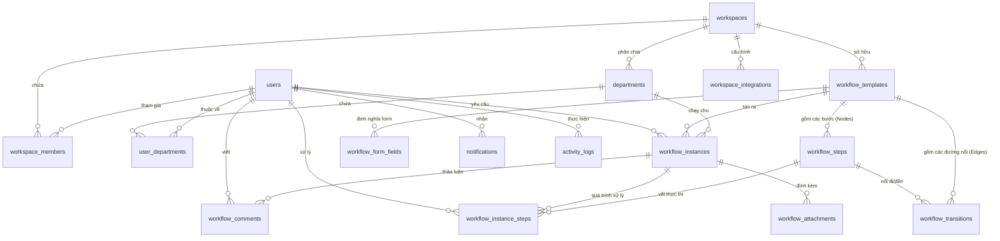

# Thiết Kế Cơ Sở Dữ Liệu & Luồng Quan Hệ

Tài liệu này đề xuất cấu trúc Database (sử dụng PostgreSQL và Prisma ORM) phục vụ cho hệ thống quản lý **Workflow kéo thả**. Bản thiết kế này đã được tối ưu hóa để hỗ trợ các tính năng nâng cao:
* Thiết lập quy trình bằng đồ thị kéo thả (Nodes & Edges).
* Rẽ nhánh điều kiện (If/Else).
* SLA (Service Level Agreement) và cảnh báo quá hạn.
* Tích hợp các kênh truyền thông (Email, Telegram, Slack).
* Quản lý đa chi nhánh/phòng ban (Multi-branch).
* Public Form cho khách hàng/khách vãng lai gửi yêu cầu.
* Webhook API gửi dữ liệu ra hệ thống ngoài.

---

## 1. Sơ đồ thực thể quan hệ (Mermaid ER Diagram)

Dưới đây là mô hình quan hệ giữa các bảng. Để hỗ trợ kéo thả, quy trình được xem như một đồ thị: các bước là **Nodes** (`workflow_steps`) và các đường nối/điều kiện rẽ nhánh là **Edges** (`workflow_transitions`).

---

## 2. Mô Tả Chi Tiết Các Bảng (Schema Specification)

### 2.1. Nhóm 1: Người dùng & Tổ chức (User & Organization)

#### Bảng `users` (Người dùng)
Lưu trữ thông tin tài khoản người dùng trong hệ thống.
* `id` (UUID, PK): Mã định danh duy nhất.
* `email` (String, Unique): Địa chỉ email.
* `password` (String): Mật khẩu băm.
* `name` (String): Họ và tên.
* `avatar_url` (String, Nullable): Đường dẫn ảnh đại diện.
* `created_at` / `updated_at` (DateTime)

#### Bảng `workspaces` (Không gian làm việc)
Hỗ trợ mô hình Multi-tenant (nhiều tổ chức dùng độc lập trên một hệ thống).
* `id` (UUID, PK): Mã định danh.
* `name` (String): Tên công ty/tổ chức.
* `slug` (String, Unique): Đường dẫn định danh (vd: `congtya`).
* `owner_id` (UUID, FK -> `users.id`): Người sở hữu workspace.
* `created_at` / `updated_at` (DateTime)

#### Bảng `workspace_members` (Thành viên của Workspace)
* `id` (UUID, PK)
* `workspace_id` (UUID, FK -> `workspaces.id`)
* `user_id` (UUID, FK -> `users.id`)
* `role` (Enum: `OWNER`, `ADMIN`, `MEMBER`): Vai trò trong workspace.
* `created_at` (DateTime)

#### Bảng `departments` (Chi nhánh / Phòng ban - Hỗ trợ Multi-branch)
Hỗ trợ phân cấp quản lý theo phòng ban hoặc chi nhánh địa lý.
* `id` (UUID, PK)
* `workspace_id` (UUID, FK -> `workspaces.id`)
* `name` (String): Tên chi nhánh/phòng ban (vd: "Chi nhánh Hà Nội", "Phòng Nhân sự").
* `code` (String): Mã viết tắt (vd: `CN_HN`, `HR`).
* `parent_id` (UUID, Nullable, FK -> `departments.id`): Cấu hình phòng ban cha-con.
* `created_at` / `updated_at` (DateTime)

#### Bảng `user_departments` (Liên kết Thành viên - Phòng ban)
Một nhân viên có thể thuộc nhiều chi nhánh/phòng ban với vai trò khác nhau.
* `id` (UUID, PK)
* `user_id` (UUID, FK -> `users.id`)
* `department_id` (UUID, FK -> `departments.id`)
* `role` (Enum: `MANAGER` - Trưởng phòng, `MEMBER` - Nhân viên)
* `created_at` (DateTime)

---

### 2.2. Nhóm 2: Định nghĩa Quy trình (Workflow Template Definition)
*Thiết kế phục vụ trực tiếp cho giao diện kéo thả dạng Node-Edge (ví dụ: React Flow).*

#### Bảng `workflow_templates` (Mẫu Quy trình)
* `id` (UUID, PK)
* `workspace_id` (UUID, FK -> `workspaces.id`)
* `name` (String): Tên quy trình (vd: "Đề xuất Mua sắm trang thiết bị").
* `description` (String, Nullable): Mô tả quy trình.
* `is_public` (Boolean, Default: `false`): Cho phép khách hàng vãng lai gửi yêu cầu từ ngoài hệ thống.
* `public_slug` (String, Unique, Nullable): URL cho form công khai (vd: `request/mua-sam-thiet-bi`).
* `created_by_id` (UUID, FK -> `users.id`)
* `is_active` (Boolean, Default: `true`): Trạng thái kích hoạt.
* `created_at` / `updated_at` (DateTime)

#### Bảng `workflow_steps` (Các Bước trong Quy trình - Nodes)
Đại diện cho các nút trên giao diện thiết kế kéo thả.
* `id` (UUID, PK)
* `template_id` (UUID, FK -> `workflow_templates.id` on delete CASCADE)
* `name` (String): Tên bước (vd: "Trưởng phòng duyệt", "Gửi mail thông báo").
* `type` (Enum):
  * `START`: Điểm bắt đầu.
  * `APPROVAL`: Bước phê duyệt (Chấp nhận / Từ chối).
  * `INPUT`: Bước yêu cầu bổ sung thông tin từ form.
  * `IF_ELSE`: Bước điều kiện rẽ nhánh (nút logic).
  * `INTEGRATION_EMAIL`: Tự động gửi email.
  * `INTEGRATION_TELEGRAM_SLACK`: Tự động gửi thông điệp vào nhóm chat.
  * `WEBHOOK`: Gửi API request đến hệ thống khác.
  * `END`: Kết thúc quy trình.
* `config` (JSON): Cấu hình linh hoạt của từng loại bước:
  * Nếu là `APPROVAL`: Cấu hình người duyệt (theo ID user, hoặc theo Role/Chức vụ phòng ban).
  * Nếu là `INTEGRATION_EMAIL`: Nội dung tiêu đề, nội dung email, người nhận.
  * Nếu là `WEBHOOK`: URL API, headers, method (POST/GET), mapping dữ liệu.
* `sla_duration` (Int, Nullable): Thời hạn xử lý bước này (tính bằng phút). Hỗ trợ tính năng **SLA**.
* `sla_action` (Enum, Default: `NONE`): Hành động tự động khi quá hạn (vd: `AUTO_APPROVE`, `AUTO_REJECT`, `ESCALATE` - Báo cáo cấp trên).
* `x_pos` / `y_pos` (Float): Toạ độ X, Y trên canvas thiết kế để lưu vị trí khi kéo thả.
* `created_at` / `updated_at` (DateTime)

#### Bảng `workflow_transitions` (Đường liên kết & Điều kiện rẽ nhánh - Edges)
Lưu các mũi tên nối giữa các bước và điều kiện đi qua mũi tên đó.
* `id` (UUID, PK)
* `template_id` (UUID, FK -> `workflow_templates.id` on delete CASCADE)
* `from_step_id` (UUID, FK -> `workflow_steps.id`)
* `to_step_id` (UUID, FK -> `workflow_steps.id`)
* `condition_rules` (JSON, Nullable): Điều kiện logic để kích hoạt nhánh này (Ví dụ: `if (total_amount > 10000000)`). Định dạng JSON lưu trữ điều kiện: `{ "field": "total_amount", "operator": "gt", "value": 10000000 }`.
* `created_at` (DateTime)

#### Bảng `workflow_form_fields` (Trường dữ liệu của Form)
Định nghĩa các ô nhập liệu của quy trình. Khách hàng/nhân viên sẽ điền vào form này khi tạo yêu cầu.
* `id` (UUID, PK)
* `template_id` (UUID, FK -> `workflow_templates.id` on delete CASCADE)
* `step_id` (UUID, Nullable, FK -> `workflow_steps.id`): Cấu hình trường này xuất hiện ở bước cụ thể nào, nếu `null` thì mặc định xuất hiện ở bước khởi tạo.
* `name` (String): Mã trường (vd: `amount`, `reason`).
* `label` (String): Nhãn hiển thị (vd: "Số tiền", "Lý do mua").
* `field_type` (Enum: `TEXT`, `NUMBER`, `DATE`, `SELECT`, `TEXTAREA`, `FILE`): Kiểu dữ liệu.
* `is_required` (Boolean, Default: `false`)
* `options` (JSON, Nullable): Chứa mảng các giá trị lựa chọn đối với kiểu dữ liệu `SELECT`.
* `validation_rules` (JSON, Nullable): Các ràng buộc nâng cao (Ví dụ: giá trị min, max, định dạng regex).
* `order` (Int): Thứ tự hiển thị trên form.
* `created_at` (DateTime)

---

### 2.3. Nhóm 3: Thực thi Quy trình (Workflow Run / Instance)

#### Bảng `workflow_instances` (Lượt chạy quy trình / Phiếu yêu cầu)
Mỗi lần người dùng gửi một phiếu (đơn xin phép, đề xuất sắm đồ), hệ thống tạo một Instance.
* `id` (UUID, PK)
* `template_id` (UUID, FK -> `workflow_templates.id`)
* `title` (String): Tiêu đề phiếu (vd: "Đề xuất mua Laptop cho nhân viên mới - Nguyễn Văn A").
* `requester_id` (UUID, Nullable, FK -> `users.id`): Người gửi yêu cầu. Sẽ bằng `null` nếu gửi từ **Public Form** (khách vãng lai).
* `requester_email` (String, Nullable): Dùng để liên lạc/thông báo khi gửi từ Public Form.
* `current_step_id` (UUID, Nullable, FK -> `workflow_steps.id`): Bước hiện tại phiếu đang dừng lại để xử lý.
* `status` (Enum: `PENDING` - Đang chờ, `RUNNING` - Đang xử lý, `COMPLETED` - Đã duyệt xong, `REJECTED` - Bị từ chối, `CANCELLED` - Đã hủy).
* `current_data` (JSON): Toàn bộ dữ liệu người dùng đã điền của phiếu này (Lưu trữ dạng key-value: `{ "amount": 15000000, "reason": "Mua Macbook Pro" }`).
* `branch_id` (UUID, Nullable, FK -> `departments.id`): Chi nhánh/Phòng ban xử lý (đáp ứng đa chi nhánh).
* `created_at` / `updated_at` (DateTime)

#### Bảng `workflow_instance_steps` (Chi tiết bước thực thi của phiếu)
Nhật ký thực thi của từng bước cụ thể của một phiếu yêu cầu.
* `id` (UUID, PK)
* `instance_id` (UUID, FK -> `workflow_instances.id` on delete CASCADE)
* `step_id` (UUID, FK -> `workflow_steps.id`)
* `status` (Enum: `PENDING` - Đang chờ, `IN_PROGRESS` - Đang làm, `COMPLETED` - Đã hoàn thành, `OVERDUE` - Đã quá hạn SLA, `SKIPPED` - Bỏ qua do rẽ nhánh).
* `assigned_to_user_id` (UUID, Nullable, FK -> `users.id`): Người chịu trách nhiệm xử lý bước này.
* `started_at` (DateTime): Thời điểm bắt đầu bước (để tính SLA).
* `due_at` (DateTime, Nullable): Thời điểm hạn chót phải xử lý xong (tính bằng `started_at` + `workflow_steps.sla_duration`).
* `completed_at` (DateTime, Nullable): Thời điểm hoàn thành thực tế.
* `action_taken` (Enum, Nullable: `APPROVE`, `REJECT`, `SUBMIT`, `AUTO_SYSTEM`): Quyết định của người xử lý.
* `comment` (String, Nullable): Ghi chú lý do duyệt/từ chối của bước này.
* `created_at` (DateTime)

#### Bảng `workflow_comments` (Thảo luận trên phiếu)
Cho phép trao đổi trực tiếp trên từng phiếu yêu cầu.
* `id` (UUID, PK)
* `instance_id` (UUID, FK -> `workflow_instances.id` on delete CASCADE)
* `user_id` (UUID, FK -> `users.id`): Người bình luận.
* `content` (Text): Nội dung bình luận.
* `created_at` (DateTime)

#### Bảng `workflow_attachments` (Tài liệu đính kèm)
* `id` (UUID, PK)
* `instance_id` (UUID, FK -> `workflow_instances.id` on delete CASCADE)
* `step_id` (UUID, Nullable, FK -> `workflow_steps.id`): File đính kèm tại bước nào.
* `uploaded_by_id` (UUID, Nullable, FK -> `users.id`)
* `file_name` (String): Tên file gốc.
* `file_url` (String): Đường dẫn file lưu trữ trên cloud (S3 / Local storage).
* `file_size` (Int): Dung lượng file.
* `created_at` (DateTime)

---

### 2.4. Nhóm 4: Tích Hợp & Logs (Integration & System Logging)

#### Bảng `workspace_integrations` (Cấu hình tích hợp bên thứ ba)
Cấu hình tích hợp của Workspace (Telegram Bot Token, Slack Webhook URL, SMTP Server cho Email).
* `id` (UUID, PK)
* `workspace_id` (UUID, FK -> `workspaces.id`)
* `provider` (Enum: `EMAIL`, `TELEGRAM`, `SLACK`)
* `credentials` (JSON): Lưu trữ thông tin đăng nhập/token/webhook URL được mã hóa.
* `is_active` (Boolean, Default: `true`)
* `created_at` / `updated_at` (DateTime)

#### Bảng `notifications` (Thông báo người dùng)
* `id` (UUID, PK)
* `user_id` (UUID, FK -> `users.id`)
* `title` (String): Tiêu đề thông báo.
* `content` (Text): Nội dung thông báo.
* `type` (Enum: `SLA_WARNING` - Cảnh báo quá hạn, `APPROVAL_REQUEST` - Yêu cầu duyệt, `COMMENT` - Bình luận mới, `SYSTEM` - Hệ thống).
* `is_read` (Boolean, Default: `false`)
* `redirect_url` (String, Nullable): Đường dẫn truy cập nhanh khi người dùng click vào thông báo.
* `created_at` (DateTime)

#### Bảng `activity_logs` (Nhật ký hoạt động hệ thống)
* `id` (UUID, PK)
* `workspace_id` (UUID, FK -> `workspaces.id`)
* `user_id` (UUID, Nullable, FK -> `users.id`): Tác nhân thực hiện.
* `action` (String): Mô tả hành động (vd: `CREATE_TEMPLATE`, `DELETE_INSTANCE`, `UPDATE_INTEGRATION`).
* `target_type` (String): Đối tượng chịu tác động (vd: `WorkflowTemplate`, `WorkflowInstance`).
* `target_id` (String): ID đối tượng chịu tác động.
* `details` (JSON, Nullable): Dữ liệu chi tiết trước/sau khi thay đổi để phục vụ kiểm toán (Audit).
* `ip_address` (String, Nullable)
* `created_at` (DateTime)

---

## 3. Đề Xuất Luồng Nghiệp Vụ Kéo Thả Quy Trình

### 3.1. Thiết kế Giao Diện Kéo Thả (Frontend - React Flow)
Giao diện React Flow sẽ lưu trữ trạng thái thiết kế dưới dạng danh sách `nodes` (đỉnh) và `edges` (cạnh). Khi người dùng nhấn "Lưu quy trình":
1. Frontend gửi mảng các node và edge lên Backend.
2. Backend lưu các Node vào bảng `workflow_steps` (lưu cả toạ độ `x_pos`, `y_pos`).
3. Backend lưu các Edge nối vào bảng `workflow_transitions` (lưu kèm điều kiện rẽ nhánh trong trường `condition_rules`).

### 3.2. Động cơ thực thi Workflow (Workflow Engine - Backend)
Mỗi khi một bước trong phiếu yêu cầu được phê duyệt (`action_taken = APPROVE`):
1. **Tìm kiếm bước tiếp theo:** Truy vấn bảng `workflow_transitions` tìm tất cả các record có `from_step_id = current_step_id`.
2. **Đánh giá điều kiện (If/Else):**
   * Nếu không có điều kiện rẽ nhánh (`condition_rules` là null), chuyển sang bước `to_step_id`.
   * Nếu có điều kiện, động cơ sẽ đối chiếu dữ liệu của phiếu (`workflow_instances.current_data`) với logic lưu trong `condition_rules` để quyết định xem có đi qua cạnh này hay không.
3. **Thực thi hành động của Bước Tiếp Theo (`workflow_steps.type`):**
   * **`APPROVAL` / `INPUT`:** Tạo bản ghi `workflow_instance_steps` với trạng thái `PENDING` và gán cho người dùng tương ứng. Tính toán thời hạn `due_at` dựa trên `sla_duration`. Gửi thông báo đến người xử lý.
   * **`INTEGRATION_EMAIL` / `INTEGRATION_TELEGRAM_SLACK`:** Hệ thống tự động đọc cấu hình trong `workspace_integrations` để gửi mail hoặc tin nhắn thông báo, sau đó tự động kích hoạt chuyển sang bước tiếp theo (coi như bước này tự hoàn thành).
   * **`WEBHOOK`:** Thực hiện một HTTP request (POST/GET) với payload là dữ liệu hiện tại của phiếu (`current_data`) đến URL cấu hình trong bước. Sau khi nhận phản hồi thành công, tự động chuyển tiếp quy trình.
   * **`END`:** Cập nhật trạng thái phiếu (`workflow_instances.status`) thành `COMPLETED`.

### 3.3. Giải thuật Quản lý SLA & Cảnh báo quá hạn (Background Worker)
Để kiểm tra các công việc bị quá hạn xử lý (SLA):
1. Thiết lập một **cron job / background task** (ví dụ sử dụng BullMQ trong NestJS) chạy định kỳ (mỗi 5 hoặc 10 phút).
2. Tìm kiếm trong bảng `workflow_instance_steps` những bước có trạng thái là `PENDING` hoặc `IN_PROGRESS` và thời gian hiện tại đã vượt quá hạn chót `due_at` (`NOW() > due_at`).
3. Với mỗi bản ghi tìm thấy:
   * Chuyển trạng thái bước thành `OVERDUE`.
   * Đọc cấu hình `sla_action` tại bước đó (`workflow_steps.sla_action`):
     * Nếu là `AUTO_APPROVE` / `AUTO_REJECT`: Tự động ghi nhận duyệt/từ chối và chuyển tiếp quy trình.
     * Nếu là `ESCALATE` (Cảnh báo cấp trên): Tạo bản ghi thông báo trong bảng `notifications` gửi cho Trưởng bộ phận hoặc quản trị viên hệ thống, đồng thời gửi email cảnh báo thông qua dịch vụ SMTP được cấu hình.
